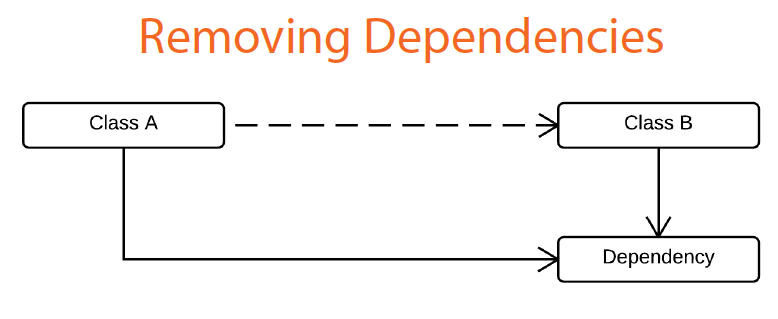
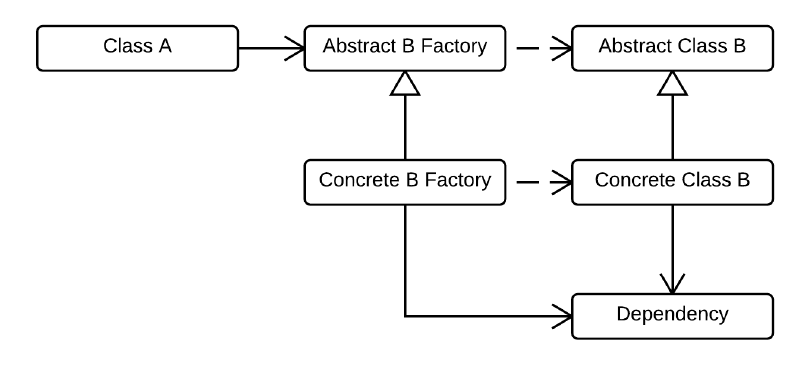

## Abstract Factory ##

Provide an interface for creating families of related or dependent objects without specifying their concrete classes

Dependency should be provided outside the caller. Downside is more classes, adding complexity.

Above shows a transitive dependency. Class B relies on a dependency. If Class B uses Class B, it forces Class A to rely on the dependency.

Look at the below diagram. Class A is changed to use an abstract factory. The abstract factory (or interface) doesn't have dependency; the concrete factory has dependency. That way, Class A doesn't have to know about the dependency. That's the trick!

